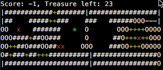

# ascii-dash
ASCII-Dash is a game similar to famous Boulder Dash. Game is very simple and easy to extend with new levels and rules.
Rules of the game are following.
Player has to collect all the coins (+) to finish the level. There are bad guys (x) you have to avoid, you will die if they catch you.
There is a notion of gravity where boulders (O) and coins can fall if there is empty space below. Watch out! player and bad guys can be crushed by a falling boulder.

Elements in the game are:
- "*" - player
- "x" - bad guy
- "O" - boulder
- "#" - soil, will substract 1 form score
- "+" - coin, will add 15 to score
- "|" - vertical wall
- "-" - horizontal wall

## Requirements
- OSX or Linux, not sure about Windows
- Scala and JVM environment installed (tested on Scala 2.11.4)

## Install
- clone repo `git clone https://github.com/martez81/ascii-dash.git`
- switch to ascii-dash dir `cd ascii-dash`
- install sbt build tool for needed `brew install sbt`
- compile `sbt "run src/main/resources/level.txt"`
- create your own level!
- enjoy
